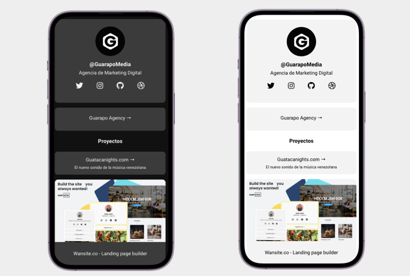

# [Startpage for Social Media]() 

**Startpage** is a **Free HTML templatet** with a simple desing for our own website builder [Wansite.co](https://wansite.co). We create this template for thouse who want to has all the information in one place and with a simple design so the user know where he needs to go.

**Startpage** has 3 different types of components, profile, button and button with picture. It can be customize with CSS variables so you can choose the best color.

This design is the result of looking at different referent and get the most important part of each one and create an unique and modern template. 

## Table of Contents

* [Versions](#versions)
* [Demo](#demo)
* [Quick Start](#quick-start)
* [Documentation](#documentation)
* [File Structure](#file-structure)
* [Browser Support](#browser-support)
* [Resources](#resources)
* [Licensing](#licensing)
* [Useful Links](#useful-links)

## Versions

- HTML
- React (WIP)

## Demo

## Quick start

- [Download from Github](https://guarapomedia.github.io/html-startpage/).
- [Download from Guarapo Media](https://guarapomedia.com).
- Clone the repo: `git clone https://github.com/guarapomedia/html-startpage.git`.

light theme:
`   --BgColor: #ffffff;
    --PrimaryColor: #000000;
    --BgCard: #f3f3f3;
    --ButtonColor: #f3f3f3;
    --ButtonText: #000000;
    --ButtonRadius: 10px;
    --FontFamily: Roboto, sans-serif;`

dark theme:
`   --BgColor: #333333;
    --PrimaryColor: #16171b;
    --BgCard: #ffffff;
    --ButtonColor: #16171b;
    --ButtonText: #ffffff;
    --ButtonRadius: 10px;
    --FontFamily: Roboto, sans-serif;`

## Licensing

- Licensed under MIT (https://github.com/guarapomedia/html-startpage/blob/main/licence.md)

### Contact Us

Website: <https://guarapomedia.com>

Twitter: <https://twitter.com/guarapomedia>

Facebook: <https://www.facebook.com/guarapomedia>

Dribbble: <https://dribbble.com/guarapomedia>

Instagram: <https://www.instagram.com/guarapomedia>